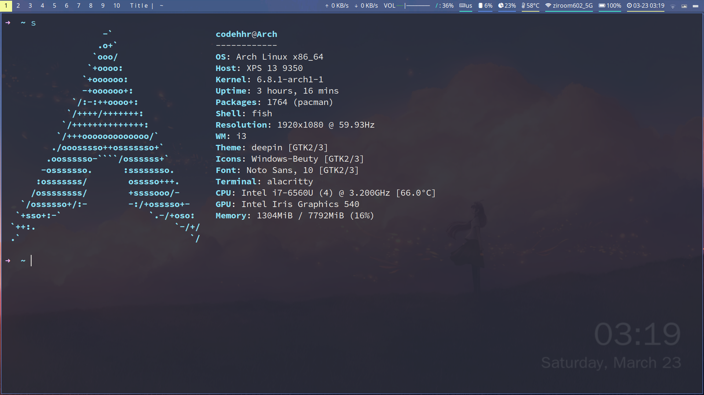

# i3wm 的配置文件

`polybar` : [https://github.com/codehhr/polybar](https://github.com/codehhr/polybar)

`alacritty` : [https://github.com/codehhr/alacritty](https://github.com/codehhr/alacritty)

`st` : [https://github.com/codehhr/st](https://github.com/codehhr/st)
